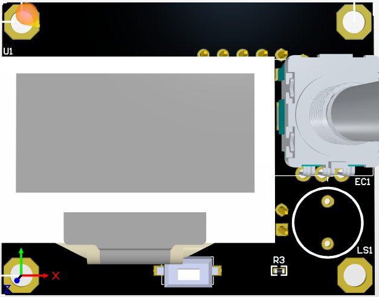

# OLED_12864

## 产品介绍




这是一个便宜，带RGB指示灯，通用于marlin的显示屏，支持脱机打印，分辨率为12864，显示区域为2.4’‘，SD卡座可以为侧式或者立式，方便不同的安装场合，非常适用于小型3D打印机。

一个版本有两个SD卡接口，小卡和打卡，根据自己需要进行选择焊接，RGB接口可以选择接入。

## 特征

- 2.4" 英寸高对比度图形 LCD
-  与主机微控制器的 SPI 通信
-  支持带卡检测的侧面 SD 插槽
-  旋转编码器
- 可配置的RGB LED灯\n - 软件可配置对比度设置
- 3D 可打印外壳和安装 STL 文件 
- EXP1 & EXP2 RAMPS 兼容插座2.4"

## 应用

3D打印机CNC机器其他微控制器项目


## 典型接线


## 注意/NOTICE：

| SCH                                                          | Description                                                  |
| ------------------------------------------------------------ | ------------------------------------------------------------ |
|  | 为了兼容某些主板，如RAMPS1.4，mini12864 设置了 RST(R3) 和 KILL(R4) 的可选择电阻。目前，有些主板（S6/Spider）将 KILL 换成 5V，此时，请确认 mini12864 上 R4处于空贴状态，否则按下屏幕上的按钮会致使 5V 与 GND 短路，长时间操作会导致主板损坏。<br/> |

## 固件配置/Firmware config

这个屏幕驱动是SH1106，兼容marlin Mini面板。 已经测试好了，但是需要如下配置。

**在开始之前，请安装最新版本的 U8glib。**

##### 第一步. 更改管脚。

在 RAMPS 兼容板上, 您需要在 pin_RAMPS.h 中进行以下更改：

``` cpp tab='pins_RAMPS.h'
  #if ENABLED(MKS_12864OLED) || ENABLED(MKS_12864OLED_SSD1306)
      // Pins for DOGM SPI LCD Support
      #define DOGLCD_A0  16
      #define DOGLCD_CS  17
      #define LCD_BACKLIGHT_PIN -1 // backlight LED on A11/D65
      #define LCD_RESET_PIN  23
      #define SDSS   53

      #define KILL_PIN -1
      #define LCD_CONTRAST 200
      #define BTN_EN1 31
      #define BTN_EN2 33
      #define BTN_ENC 35  //the click switch
    
      #define SD_DETECT_PIN 49
```

**第二步.配置 configuration.h.**


##### 第三步.配置 configuration_adv.h.


##### 第四步.添加代码到ultralcd_impl_DOGM.h.


## 原理图
---------


### 2. 工程图

---------


```

```